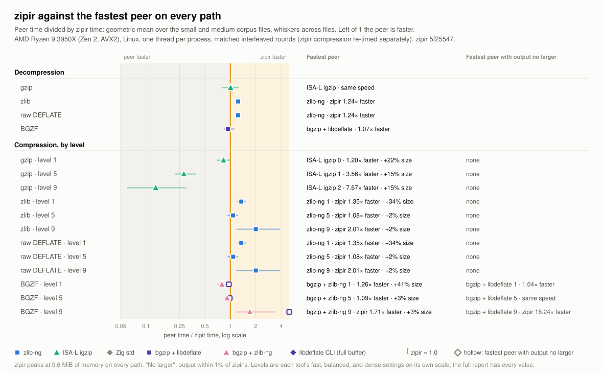

<!-- markdownlint-disable MD033 MD041 -->

<div align="center">
  
  <!-- <h1>ZIPIR</h1> -->
  <p><strong>Native Zig streaming compression and decompression for gzip, zlib, raw DEFLATE, BGZF, and tar streams.</strong></p>
  <p>
    
    <a href="https://ziglang.org/download/"></a>
    
    
    <a href="LICENSE"></a>
  </p>
</div>

<!-- Future status links. Replace REPOSITORY with the actual GitHub owner/repository before enabling these links.
<p align="center">
  <a href="https://github.com/REPOSITORY/actions/workflows/ci.yml"></a>
  <a href="https://github.com/REPOSITORY/releases/latest"></a>
</p>
<p align="center">
  <a href="https://github.com/REPOSITORY/wiki"></a>
  <a href="bench/"></a>
  <a href="CHANGELOG.md"></a>
  <a href="docs/"></a>
</p>
-->

---

> [!NOTE]
> `zipir` takes its name from the Turkish word `zıpır`, meaning lively, restless, or mischievous. The ASCII spelling also hints at `zip` and keeps the name easy to use in source code and command lines. The playful name does not change the deliberately explicit API names or format terminology.

## Why zipir exists

I kept reaching for compression in my other projects. Zig's standard library already provides most commonly used algorithms and gives me a strong starting point, but my workflows keep raising the same questions: how much memory does a stream need, where does checksum work happen, and which hot paths are worth tuning? Calling C libraries is one of Zig's strengths, but it can add a static dependency and another build choice to every project that uses it. Zipir is my attempt to keep the common path in one small Zig package that my projects can share.

The library has no external dependencies, does not create threads, and does not allocate during codec operations. The goal is not to replace every compression library. The goal is to make the common bounded streaming path pleasant to use and straightforward to measure.

## Supported codecs

| Format      | Compress | Decompress | Note                       |
| ----------- | -------- | ---------- | -------------------------- |
| gzip        | Yes      | Yes        | Concatenated members       |
| zlib        | Yes      | Yes        | n/a                        |
| raw DEFLATE | Yes      | Yes        | No header or check         |
| BGZF        | Yes      | Yes        | Seeking and `.gzi` indexes |
| Zstandard   | No       | No         | Possible future format     |
| LZ4         | No       | No         | Possible future format     |
| XZ          | No       | No         | Possible future format     |
| bzip2       | No       | No         | Possible future format     |

The future rows are possibilities, not a delivery order or a promise to support every format. Zipir will stay focused on formats that fit its Zig-first, bounded-streaming goals.

- Compression with three presets for every format: `fast`, `even` (the default), and `dense`.
- Streaming gzip decompression with header checks, CRC32, ISIZE, and concatenated members.
- Streaming zlib and raw DEFLATE decompression with a trailing-data policy and an output limit; zlib adds RFC 1950 header checks and Adler-32.
- BGZF with block-size checks, seeking by virtual offset or through a `.gzi` index, and block-level coding.
- tar stream reading and writing (ustar, pax, GNU) that pairs with any compressor or decompressor.
- Caller-owned `std.Io.Reader` and `std.Io.Writer` interfaces with reusable bounded workspaces.

> [!NOTE]
> `zipir` will slowly build its accelerators in the form of hand-rolled SIMD tested on specific architecture. Currently I cannot promise a full and comprehensive support. I am building things that specifically suits my needs and will target my computer and my os first. I always keep in mind portability, and compatibility but for the work for actually pushing performance they are extremely time consuming to build for across a wide range of cpu, os archtectures. So I wanted to mention I will always keep fallbacks so the there won't be missing functionality, but speed and memory optimizations might be missing. My first target is `linux, x86-64, axv2`. I have test environments for various others but they will have to come later.

## Quick start

Requires Zig 0.16.0.

```sh
zig build -Doptimize=ReleaseFast
./zig-out/bin/zipir compress input > input.gz
./zig-out/bin/zipir compress --dense input > input.dense.gz
./zig-out/bin/zipir decompress input.gz > input.out
./zig-out/bin/zipir test < input.gz
./zig-out/bin/zipir compress --format bgzf reads.fastq > reads.fastq.gz
./zig-out/bin/zipir bgzf index reads.fastq.gz
./zig-out/bin/zipir tar create notes > notes.tar.gz
./zig-out/bin/zipir tar list notes.tar.gz
```

`compress` writes gzip at the `--even` preset unless `--format` (`gzip`, `zlib`, `deflate`, `bgzf`) or `--fast` or `--dense` says otherwise. `decompress` and `test` detect gzip, BGZF, and zlib; raw DEFLATE has no signature and needs `--format deflate`. BGZF blocks end at text lines, as `bgzip`'s do, unless the input has NUL bytes or `--binary` is given; `bgzf index` writes the `.gzi` file `bgzip -r` writes. `tar list`, `tar test`, and `tar create` work on plain, gzip, zlib, and BGZF archives; zipir does not extract archives. `zipir --help` lists every option.

The default build targets the host CPU. `-Dcpu=baseline` builds a portable binary that still picks the PCLMUL CRC-32 and AVX2 Adler-32 kernels at run time when the CPU has them. `-Dkernel-backend=portable` forces every kernel onto its portable path; it replaces 0.1.2's `-Dadler-backend=scalar`.

## Library

Every decompressor is a `std.Io.Reader` over any input reader, and every compressor is a `std.Io.Writer` into any output writer. The caller owns the workspace (about 197 KB to decode, 429 KB to encode), sets it up in place with `init`, and reuses it; nothing is allocated.

```zig
const zipir = @import("zipir");

// Decoded bytes, borrowed a chunk at a time.
const decoder = try allocator.create(zipir.gzip.Decompressor);
defer allocator.destroy(decoder);
decoder.init(&file_reader.interface, .{});
while (decoder.reader.peekGreedy(1)) |chunk| {
    use(chunk);
    decoder.reader.toss(chunk.len);
} else |err| switch (err) {
    error.EndOfStream => {},
    error.ReadFailed => return decoder.err.?, // CrcMismatch, Truncated, ..., or the input's ReadFailed
}

// Plain bytes in, one gzip member out; the output does not depend on the write sizes.
const encoder = try allocator.create(zipir.gzip.Compressor);
defer allocator.destroy(encoder);
try encoder.init(&out.interface, .{ .preset = .even }); // .fast, .even, or .dense
try encoder.writer.writeAll(record);
_ = try encoder.finish();
try out.interface.flush();
```

A whole stream is one pump either way: `decoder.reader.streamRemaining(writer)`, or `input.streamRemaining(&encoder.writer)` then `encoder.finish()`. Every format namespace (`zipir.gzip`, `zipir.zlib`, `zipir.deflate`, `zipir.bgzf`) has the same `Decompressor`, `DecompressOptions`, `DecompressError`, `Compressor`, `CompressOptions`, and `CompressError`, so zlib and raw DEFLATE read and write exactly as above. `max_output_bytes` bounds decoded output and gzip's `max_header_bytes` bounds header fields.

BGZF adds block-level work and random access: the compressor can fill a `.gzi` index as it writes, and the decompressor seeks by virtual offset (`seek`) or by uncompressed offset through the index (`seekUncompressed`).

```zig
var entries: [4096]zipir.bgzf.IndexEntry = undefined;
var index: zipir.bgzf.IndexBuilder = .init(&entries);
const writer = try allocator.create(zipir.bgzf.Compressor);
defer allocator.destroy(writer);
try writer.init(&out.interface, .{ .preset = .fast, .split = .lines, .index = &index });
try writer.writer.writeAll(reads);
_ = try writer.finish();
try out.interface.flush();
try zipir.bgzf.writeIndex(&gzi.interface, index.slice());

const reader = try allocator.create(zipir.bgzf.Decompressor);
defer allocator.destroy(reader);
reader.init(&file_reader.interface, .{});
try reader.seekUncompressed(&file_reader, index.slice(), 1_000_000);
const line = try reader.reader.takeDelimiterExclusive('\n');
```

tar joins the codecs through the same interfaces: `zipir.tar.Writer(Source)` is a reader of the archive it builds, so a compressor pulls from it, and `zipir.tar.Reader(Visitor)` is a writer that calls the visitor per entry, so a decompressor pushes into it. A `.tar.gz` round trip:

```zig
// Source declares `next(*Source) !?zipir.tar.Entry` and `data(*Source) *std.Io.Reader`.
var tar_buffer: [4096]u8 = undefined;
var archive: zipir.tar.Writer(Source) = .init(&source, &tar_buffer, .{});
try gz.init(&out.interface, .{});
_ = try archive.reader.streamRemaining(&gz.writer);
_ = try gz.finish();
try out.interface.flush();

// Visitor declares `entry(*Visitor, Entry) !Action`, `data(*Visitor, []const u8) !void`, and `entryEnd(*Visitor) !void`.
var name: [zipir.tar.MAX_NAME + 1]u8 = undefined;
var link: [zipir.tar.MAX_NAME + 1]u8 = undefined;
var tar_reader: zipir.tar.Reader(Visitor) = .init(&visitor, .{ .name = &name, .link = &link });
gunzip.init(&in.interface, .{});
_ = try gunzip.reader.streamRemaining(&tar_reader.writer);
const summary = try tar_reader.finish(); // entries, and whether the end blocks were there
```

To use zipir from another Zig project, add it to `build.zig.zon` (for example `.zipir = .{ .path = "../zipir" }`) and import its module:

```zig
const zipir = b.dependency("zipir", .{ .target = target, .optimize = optimize });
exe.root_module.addImport("zipir", zipir.module("zipir"));
```

## Benchmarks

<p align="center">
  <a href="bench/linux-x86-avx2/README.md">
    <picture>
      <source media="(prefers-color-scheme: dark)" srcset="bench/linux-x86-avx2/figures/summary-dark.svg">
      <source media="(prefers-color-scheme: light)" srcset="bench/linux-x86-avx2/figures/summary-light.svg">
      
    </picture>
  </a>
</p>
<p align="center"><sub>Whole-command time against the fastest single-threaded peer on one Linux x86-64 host (AMD Ryzen 9 3950X, AVX2). Left of 1 the peer is faster. For compression, a faster peer often writes larger files, so the hollow marker shows the fastest peer whose output is no larger than zipir's. Open the report for speed-ratio curves, memory, every measured value, and the method.</sub></p>

The [full report](bench/linux-x86-avx2/README.md) covers gzip, zlib, raw DEFLATE, and BGZF on sequencing, mass spectrometry, and general corpus files against zlib-ng, ISA-L igzip, the Zig standard library, and htslib `bgzip` built with libdeflate and with zlib-ng. Every tool's output was checked against an independent decoder before it was timed. The comparison adapters, corpus, and checks live in [`tools/`](tools/).

The report predates the release code: its zipir compression rows were measured at commit `5f25547` and its decompression rows at `ff8e9e8`, before 0.2.0's last decode-speed changes and the move to `std.Io` readers and writers. A matched run of the same peers on the small files at the release code showed decompression faster and gzip, zlib, and raw DEFLATE compression a few percent slower (the cost of the writer interface), with identical compressed bytes. The timing tool is [Zebrac](https://github.com/eneskemalergin/zebrac) 0.6.2.

## Roadmap

- Decode each BGZF block whole with its size known, the largest remaining gap on the bioinformatics path.
- Recover the 2% to 3% that gzip, zlib, and raw DEFLATE compression gave up for the writer interface in 0.2.0.
- Keep tuning against real corpus shapes without losing bounded streaming behavior.
- Extend the benchmark report: large files, more peers, and a single command that reruns it.
- Move the complete API, format notes, and benchmark methods into the wiki.

## Development

```sh
zig fmt --check src tests build.zig tools/build.zig tools/zig
zig build test --summary all
zig build test -Doptimize=ReleaseSafe --summary all
zig build test -Doptimize=ReleaseFast --summary all
zig build test -Dkernel-backend=portable --summary all
zig build test -Dcpu=baseline --summary all
```

The same checks, plus the four cross-target compiles and `shellcheck`, run in CI (`.github/workflows/ci.yml`).

---

<p align="center"><em>
  Narrow banks hold fast -<br>
  great rivers fold into mist,<br>
  no new soil disturbed.
</em></p>
