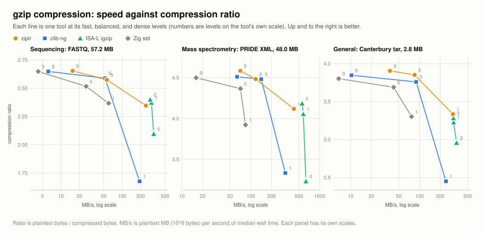
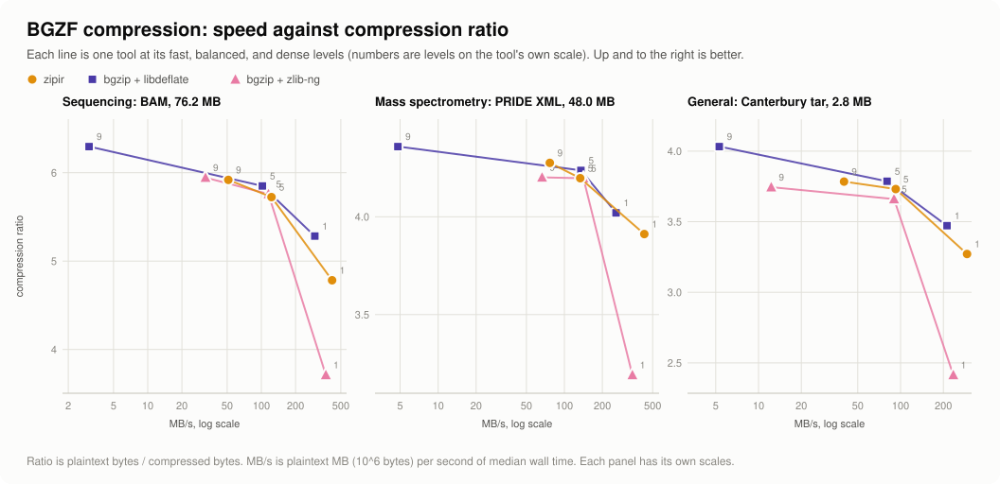
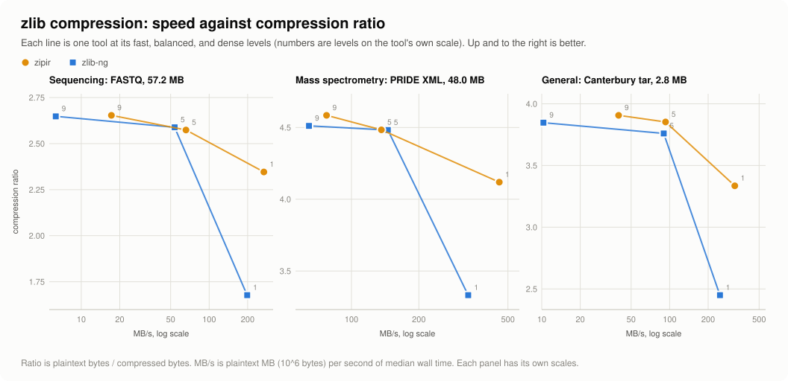
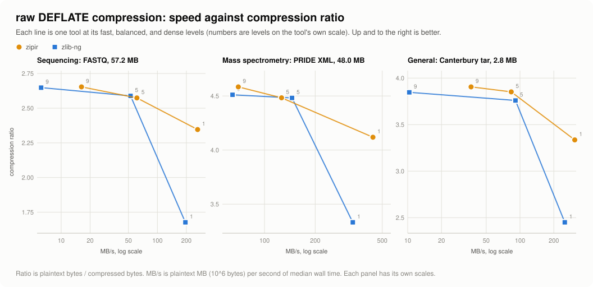
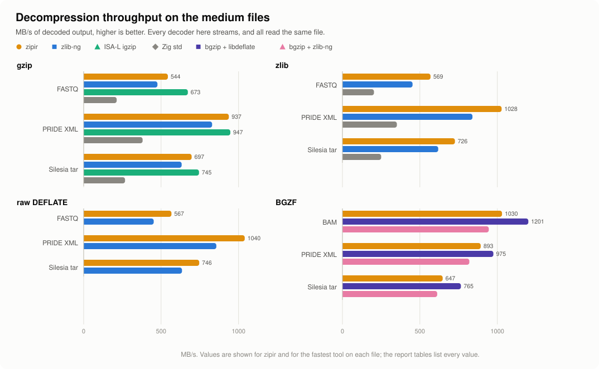
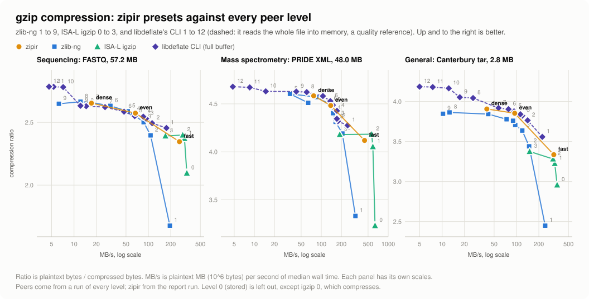
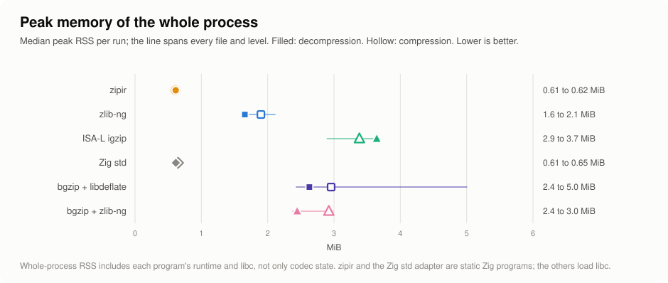

# zipir benchmark: linux-x86-avx2

zipir `fc81d5201bab` (uncommitted changes), measured on 2026-09-27. One host: AMD Ryzen 9 3950X, Linux 7.2.7-200.fc44.x86_64 x86_64.

This report shows where zipir stands against the fastest single-threaded tools on the same machine, on every format zipir writes and reads. Compression is a trade-off between speed and output size, so compression results always show both; decompression output is identical across tools, so speed and memory are the whole story there.

## Summary

  <picture>
    <source media="(prefers-color-scheme: dark)" srcset="figures/summary-dark.svg">
    <source media="(prefers-color-scheme: light)" srcset="figures/summary-light.svg">
    
  </picture>

Each row compares zipir with every peer on the same path and names the fastest one; its marker sits left of 1.0 when the peer is faster. For compression, the fastest peer is often fast because it writes larger output, so a hollow marker shows the fastest peer whose output is no larger than zipir's (within 1%). "Level 1" compares each tool's fast level, "5" balanced, and "9" dense, on each tool's own scale ([Levels](#levels)).

| Path | Level | Fastest peer | Peer time / zipir (range) | Its output | Fastest peer no larger than zipir | zipir MB/s |
| --- | ---: | --- | ---: | ---: | --- | ---: |
| gzip decompress |  | ISA-L igzip | 1.01 (0.81 to 1.25) |  |  | 544 to 1082 |
| zlib decompress |  | zlib-ng | 1.24 (1.17 to 1.27) |  |  | 569 to 1171 |
| raw DEFLATE decompress |  | zlib-ng | 1.24 (1.18 to 1.28) |  |  | 567 to 1210 |
| BGZF decompress |  | bgzip + libdeflate | 0.94 (0.85 to 1.11) |  |  | 586 to 1030 |
| gzip compress | 1 | ISA-L igzip 0 | 0.82 (0.68 to 0.98) | +22% size | none | 258 to 436 |
| gzip compress | 5 | ISA-L igzip 1 | 0.27 (0.22 to 0.37) | +15% size | none | 65 to 142 |
| gzip compress | 9 | ISA-L igzip 2 | 0.13 (0.06 to 0.30) | +15% size | none | 17 to 88 |
| zlib compress | 1 | zlib-ng 1 | 1.33 (1.22 to 1.47) | +34% size | none | 263 to 453 |
| zlib compress | 5 | zlib-ng 5 | 1.03 (0.88 to 1.19) | +1.5% size | none | 64 to 144 |
| zlib compress | 9 | zlib-ng 9 | 1.95 (1.16 to 3.76) | +2% size | none | 17 to 87 |
| raw DEFLATE compress | 1 | zlib-ng 1 | 1.34 (1.22 to 1.53) | +34% size | none | 267 to 458 |
| raw DEFLATE compress | 5 | zlib-ng 5 | 1.03 (0.88 to 1.21) | +1.5% size | none | 64 to 141 |
| raw DEFLATE compress | 9 | zlib-ng 9 | 1.97 (1.18 to 3.70) | +2% size | none | 17 to 89 |
| BGZF compress | 1 | bgzip + zlib-ng 1 | 1.25 (1.13 to 1.39) | +32% size | bgzip + libdeflate 1: 1.51 | 294 to 429 |
| BGZF compress | 5 | bgzip + zlib-ng 5 | 1.05 (0.94 to 1.11) | +1.3% size | bgzip + libdeflate 5: 1.12 | 93 to 133 |
| BGZF compress | 9 | bgzip + zlib-ng 9 | 1.65 (1.15 to 3.26) | +3% size | bgzip + libdeflate 9: 15.71 | 40 to 93 |

### Reading the summary

- Decompression: zipir is the fastest tool on zlib and raw DEFLATE.
- Decompression: on gzip, zipir and ISA-L igzip are level on average; per file the peer ranges from 0.80x to 1.24x zipir's speed.
- Decompression: on BGZF, bgzip + libdeflate is 1.07x faster than zipir on average (0.90x to 1.18x across files).
- Compression level 1 (fast): no peer reaches zipir's output size on gzip, zlib and raw DEFLATE; no peer with output no larger than zipir's is faster on BGZF; the fastest peer at any size is ISA-L igzip 0, 1.2x faster with 22% larger output.
- Compression level 5 (balanced): no peer reaches zipir's output size on gzip, zlib and raw DEFLATE; no peer with output no larger than zipir's is faster on BGZF; the fastest peer at any size is ISA-L igzip 1, 3.8x faster with 15% larger output.
- Compression level 9 (dense): no peer reaches zipir's output size on gzip, zlib and raw DEFLATE; no peer with output no larger than zipir's is faster on BGZF; the fastest peer at any size is ISA-L igzip 2, 7.9x faster with 15% larger output.
- Memory: zipir peaks at 0.54 to 0.62 MiB on every path; the C tools peak at 1.6 to 5.0 MiB (whole process, see [Memory](#memory)).

## Compression: speed against ratio

A single level says little about a compressor: a faster tool can simply be writing more bytes. These figures place every tool's fast, balanced, and dense levels on speed and compression ratio together. zlib and raw DEFLATE use the same engine as gzip in every tool here, so their curves follow gzip's; their figures and tables are in the folded sections below. zlib and raw DEFLATE have no ISA-L or Zig std compressor in this run.

  <picture>
    <source media="(prefers-color-scheme: dark)" srcset="figures/tradeoff-gzip-dark.svg">
    <source media="(prefers-color-scheme: light)" srcset="figures/tradeoff-gzip-light.svg">
    
  </picture>

  <picture>
    <source media="(prefers-color-scheme: dark)" srcset="figures/tradeoff-bgzf-dark.svg">
    <source media="(prefers-color-scheme: light)" srcset="figures/tradeoff-bgzf-light.svg">
    
  </picture>

Each cell: MB/s · compression ratio. Peer cells add their time relative to zipir at the same level (below 1× is faster) and their output size relative to zipir's (+ is larger).

### gzip compression

| Tool | Level | FASTQ, 57.2 MB | FASTQ, 20.2 MB | PRIDE XML, 48.0 MB | mzIdentML, 1.2 MB | Canterbury tar, 2.8 MB |
| --- | --- | --- | --- | --- | --- | --- |
| **zipir** | 1 | 257.6 MB/s · 2.346 | 436.5 MB/s · 4.684 | 428.0 MB/s · 4.119 | 333.7 MB/s · 4.307 | 307.1 MB/s · 3.335 |
| **zipir** | 5 | 64.8 MB/s · 2.574 | 141.9 MB/s · 6.084 | 127.4 MB/s · 4.483 | 120.7 MB/s · 4.859 | 88.9 MB/s · 3.852 |
| **zipir** | 9 | 16.8 MB/s · 2.654 | 58.8 MB/s · 6.325 | 73.1 MB/s · 4.584 | 88.1 MB/s · 4.745 | 38.1 MB/s · 3.905 |
| zlib-ng | 1 | 192.7 MB/s · 1.677 · 1.34× · +40% | 363.3 MB/s · 3.648 · 1.20× · +28% | 317.7 MB/s · 3.332 · 1.35× · +24% | 229.2 MB/s · 3.008 · 1.46× · +43% | 241.5 MB/s · 2.449 · 1.27× · +36% |
| zlib-ng | 5 | 52.4 MB/s · 2.589 · 1.24× · -0.6% | 128.3 MB/s · 5.999 · 1.11× · +1.4% | 141.9 MB/s · 4.482 · 0.90× · ±0% | 114.9 MB/s · 4.662 · 1.05× · +4% | 89.2 MB/s · 3.759 · 1.00× · +2% |
| zlib-ng | 9 | 6.2 MB/s · 2.648 · 2.70× · ±0% | 43.6 MB/s · 6.256 · 1.35× · +1.1% | 63.2 MB/s · 4.511 · 1.16× · +2% | 49.7 MB/s · 4.521 · 1.77× · +5% | 10.3 MB/s · 3.847 · 3.71× · +2% |
| ISA-L igzip | 0 | 327.4 MB/s · 2.095 · 0.79× · +12% | 564.3 MB/s · 4.106 · 0.77× · +14% | 632.2 MB/s · 3.231 · 0.68× · +27% | 340.1 MB/s · 2.965 · 0.98× · +45% | 344.7 MB/s · 2.957 · 0.89× · +13% |
| ISA-L igzip | 1 | 300.3 MB/s · 2.371 · 0.22× · +9% | 533.3 MB/s · 4.877 · 0.27× · +25% | 579.1 MB/s · 4.054 · 0.22× · +11% | 322.8 MB/s · 4.293 · 0.37× · +13% | 312.2 MB/s · 3.225 · 0.28× · +19% |
| ISA-L igzip | 2 | 286.6 MB/s · 2.399 · 0.06× · +11% | 511.9 MB/s · 4.917 · 0.11× · +29% | 556.0 MB/s · 4.184 · 0.13× · +10% | 297.4 MB/s · 4.362 · 0.30× · +9% | 310.4 MB/s · 3.282 · 0.12× · +19% |
| Zig std | 1 | 60.1 MB/s · 2.367 · 4.28× · -0.9% | 89.4 MB/s · 4.486 · 4.88× · +4% | 83.9 MB/s · 3.922 · 5.10× · +5% | 83.4 MB/s · 3.970 · 4.00× · +8% | 76.5 MB/s · 3.302 · 4.01× · +1.0% |
| Zig std | 5 | 25.8 MB/s · 2.516 · 2.51× · +2% | 63.5 MB/s · 5.540 · 2.24× · +10% | 70.8 MB/s · 4.366 · 1.80× · +3% | 47.9 MB/s · 4.296 · 2.52× · +13% | 42.0 MB/s · 3.688 · 2.12× · +4% |
| Zig std | 9 | 4.3 MB/s · 2.648 · 3.95× · ±0% | 18.6 MB/s · 6.213 · 3.16× · +2% | 16.1 MB/s · 4.499 · 4.54× · +2% | 37.4 MB/s · 4.477 · 2.36× · +6% | 6.7 MB/s · 3.802 · 5.68× · +3% |

<b>zlib compression</b> (same engines as gzip)

  <picture>
    <source media="(prefers-color-scheme: dark)" srcset="figures/tradeoff-zlib-dark.svg">
    <source media="(prefers-color-scheme: light)" srcset="figures/tradeoff-zlib-light.svg">
    
  </picture>

| Tool | Level | FASTQ, 57.2 MB | FASTQ, 20.2 MB | PRIDE XML, 48.0 MB | mzIdentML, 1.2 MB | Canterbury tar, 2.8 MB |
| --- | --- | --- | --- | --- | --- | --- |
| **zipir** | 1 | 262.7 MB/s · 2.346 | 453.0 MB/s · 4.684 | 450.9 MB/s · 4.119 | 334.2 MB/s · 4.307 | 316.4 MB/s · 3.335 |
| **zipir** | 5 | 63.9 MB/s · 2.574 | 143.8 MB/s · 6.084 | 128.1 MB/s · 4.483 | 116.6 MB/s · 4.859 | 88.9 MB/s · 3.852 |
| **zipir** | 9 | 16.9 MB/s · 2.654 | 60.3 MB/s · 6.325 | 74.7 MB/s · 4.584 | 86.8 MB/s · 4.745 | 38.8 MB/s · 3.905 |
| zlib-ng | 1 | 198.2 MB/s · 1.677 · 1.33× · +40% | 371.7 MB/s · 3.648 · 1.22× · +28% | 332.2 MB/s · 3.332 · 1.36× · +24% | 227.0 MB/s · 3.008 · 1.47× · +43% | 247.2 MB/s · 2.449 · 1.28× · +36% |
| zlib-ng | 5 | 53.7 MB/s · 2.589 · 1.19× · -0.6% | 131.1 MB/s · 5.999 · 1.10× · +1.4% | 145.4 MB/s · 4.482 · 0.88× · ±0% | 115.2 MB/s · 4.662 · 1.01× · +4% | 89.8 MB/s · 3.760 · 0.99× · +2% |
| zlib-ng | 9 | 6.3 MB/s · 2.648 · 2.67× · ±0% | 43.8 MB/s · 6.256 · 1.38× · +1.1% | 64.6 MB/s · 4.511 · 1.16× · +2% | 49.5 MB/s · 4.521 · 1.75× · +5% | 10.3 MB/s · 3.847 · 3.76× · +2% |

<b>raw DEFLATE compression</b> (same engines as gzip)

  <picture>
    <source media="(prefers-color-scheme: dark)" srcset="figures/tradeoff-deflate-dark.svg">
    <source media="(prefers-color-scheme: light)" srcset="figures/tradeoff-deflate-light.svg">
    
  </picture>

| Tool | Level | FASTQ, 57.2 MB | FASTQ, 20.2 MB | PRIDE XML, 48.0 MB | mzIdentML, 1.2 MB | Canterbury tar, 2.8 MB |
| --- | --- | --- | --- | --- | --- | --- |
| **zipir** | 1 | 267.2 MB/s · 2.346 | 458.1 MB/s · 4.684 | 457.1 MB/s · 4.119 | 343.5 MB/s · 4.307 | 312.2 MB/s · 3.336 |
| **zipir** | 5 | 63.9 MB/s · 2.574 | 141.2 MB/s · 6.084 | 127.7 MB/s · 4.483 | 115.7 MB/s · 4.859 | 87.5 MB/s · 3.852 |
| **zipir** | 9 | 17.1 MB/s · 2.654 | 60.3 MB/s · 6.325 | 76.0 MB/s · 4.584 | 89.0 MB/s · 4.745 | 38.3 MB/s · 3.905 |
| zlib-ng | 1 | 195.3 MB/s · 1.677 · 1.37× · +40% | 376.4 MB/s · 3.648 · 1.22× · +28% | 334.2 MB/s · 3.332 · 1.37× · +24% | 224.0 MB/s · 3.008 · 1.53× · +43% | 250.6 MB/s · 2.449 · 1.25× · +36% |
| zlib-ng | 5 | 52.6 MB/s · 2.589 · 1.21× · -0.6% | 132.3 MB/s · 5.999 · 1.07× · +1.4% | 145.8 MB/s · 4.482 · 0.88× · ±0% | 111.3 MB/s · 4.662 · 1.04× · +4% | 91.1 MB/s · 3.760 · 0.96× · +2% |
| zlib-ng | 9 | 6.2 MB/s · 2.648 · 2.75× · ±0% | 44.4 MB/s · 6.256 · 1.36× · +1.1% | 64.6 MB/s · 4.511 · 1.18× · +2% | 49.0 MB/s · 4.521 · 1.82× · +5% | 10.3 MB/s · 3.847 · 3.70× · +2% |

### BGZF compression

| Tool | Level | BAM, 76.2 MB | VCF, 11.5 MB | PRIDE XML, 48.0 MB | mzIdentML, 1.2 MB | Canterbury tar, 2.8 MB |
| --- | --- | --- | --- | --- | --- | --- |
| **zipir** | 1 | 419.0 MB/s · 4.783 | 334.1 MB/s · 3.582 | 429.4 MB/s · 3.912 | 319.3 MB/s · 4.179 | 293.9 MB/s · 3.271 |
| **zipir** | 5 | 122.7 MB/s · 5.724 | 110.2 MB/s · 4.740 | 133.4 MB/s · 4.198 | 124.4 MB/s · 4.660 | 92.5 MB/s · 3.731 |
| **zipir** | 9 | 51.2 MB/s · 5.919 | 43.2 MB/s · 5.006 | 76.7 MB/s · 4.276 | 93.0 MB/s · 4.547 | 40.0 MB/s · 3.784 |
| bgzip + libdeflate | 1 | 295.3 MB/s · 5.283 · 1.42× · -9% | 243.4 MB/s · 3.986 · 1.37× · -10% | 256.6 MB/s · 4.020 · 1.67× · -3% | 184.6 MB/s · 4.254 · 1.73× · -2% | 212.2 MB/s · 3.472 · 1.38× · -6% |
| bgzip + libdeflate | 5 | 102.0 MB/s · 5.850 · 1.20× · -2% | 91.1 MB/s · 4.849 · 1.21× · -2% | 135.2 MB/s · 4.238 · 0.99× · -0.9% | 114.8 MB/s · 4.666 · 1.08× · ±0% | 80.4 MB/s · 3.786 · 1.15× · -1.5% |
| bgzip + libdeflate | 9 | 3.0 MB/s · 6.296 · 16.81× · -6% | 3.0 MB/s · 5.390 · 14.52× · -7% | 4.8 MB/s · 4.359 · 15.99× · -2% | 2.9 MB/s · 4.928 · 32.42× · -8% | 5.3 MB/s · 4.032 · 7.56× · -6% |
| bgzip + zlib-ng | 1 | 369.5 MB/s · 3.712 · 1.13× · +29% | 268.9 MB/s · 2.688 · 1.24× · +33% | 345.7 MB/s · 3.191 · 1.24× · +23% | 230.3 MB/s · 2.921 · 1.39× · +43% | 235.2 MB/s · 2.415 · 1.25× · +35% |
| bgzip + zlib-ng | 5 | 115.6 MB/s · 5.758 · 1.06× · -0.6% | 99.7 MB/s · 4.667 · 1.11× · +2% | 141.5 MB/s · 4.197 · 0.94× · ±0% | 112.3 MB/s · 4.501 · 1.11× · +4% | 90.0 MB/s · 3.660 · 1.03× · +2% |
| bgzip + zlib-ng | 9 | 32.2 MB/s · 5.944 · 1.59× · ±0% | 37.5 MB/s · 4.777 · 1.15× · +5% | 66.6 MB/s · 4.202 · 1.15× · +2% | 52.2 MB/s · 4.300 · 1.78× · +6% | 12.3 MB/s · 3.745 · 3.26× · +1.0% |

## Decompression

  <picture>
    <source media="(prefers-color-scheme: dark)" srcset="figures/decode-dark.svg">
    <source media="(prefers-color-scheme: light)" srcset="figures/decode-light.svg">
    
  </picture>

Each cell: MB/s of decoded output; peer cells add their time relative to zipir (below 1× is faster).

### gzip decompression

| Tool | FASTQ, 57.2 MB | FASTQ, 20.2 MB | PRIDE XML, 48.0 MB | mzIdentML, 1.2 MB | Silesia tar, 211.9 MB | Canterbury tar, 2.8 MB |
| --- | --- | --- | --- | --- | --- | --- |
| **zipir** | 544 MB/s | 1082 MB/s | 937 MB/s | 569 MB/s | 697 MB/s | 732 MB/s |
| zlib-ng | 476 MB/s · 1.14× | 945 MB/s · 1.15× | 829 MB/s · 1.13× | 451 MB/s · 1.26× | 633 MB/s · 1.10× | 605 MB/s · 1.21× |
| ISA-L igzip | 673 MB/s · 0.81× | 1159 MB/s · 0.93× | 947 MB/s · 0.99× | 455 MB/s · 1.25× | 745 MB/s · 0.94× | 605 MB/s · 1.21× |
| Zig std | 213 MB/s · 2.55× | 473 MB/s · 2.29× | 381 MB/s · 2.46× | 275 MB/s · 2.07× | 267 MB/s · 2.61× | 293 MB/s · 2.50× |

### zlib decompression

| Tool | FASTQ, 57.2 MB | FASTQ, 20.2 MB | PRIDE XML, 48.0 MB | mzIdentML, 1.2 MB | Silesia tar, 211.9 MB | Canterbury tar, 2.8 MB |
| --- | --- | --- | --- | --- | --- | --- |
| **zipir** | 569 MB/s | 1171 MB/s | 1028 MB/s | 623 MB/s | 726 MB/s | 738 MB/s |
| zlib-ng | 453 MB/s · 1.26× | 934 MB/s · 1.25× | 839 MB/s · 1.22× | 489 MB/s · 1.27× | 618 MB/s · 1.17× | 587 MB/s · 1.26× |
| Zig std | 203 MB/s · 2.79× | 425 MB/s · 2.75× | 351 MB/s · 2.92× | 268 MB/s · 2.33× | 250 MB/s · 2.91× | 265 MB/s · 2.78× |

### raw DEFLATE decompression

| Tool | FASTQ, 57.2 MB | FASTQ, 20.2 MB | PRIDE XML, 48.0 MB | mzIdentML, 1.2 MB | Silesia tar, 211.9 MB | Canterbury tar, 2.8 MB |
| --- | --- | --- | --- | --- | --- | --- |
| **zipir** | 567 MB/s | 1210 MB/s | 1040 MB/s | 607 MB/s | 746 MB/s | 754 MB/s |
| zlib-ng | 452 MB/s · 1.25× | 969 MB/s · 1.25× | 857 MB/s · 1.21× | 474 MB/s · 1.28× | 635 MB/s · 1.18× | 607 MB/s · 1.24× |

### BGZF decompression

| Tool | BAM, 76.2 MB | VCF, 11.5 MB | PRIDE XML, 48.0 MB | mzIdentML, 1.2 MB | Silesia tar, 211.9 MB | Canterbury tar, 2.8 MB |
| --- | --- | --- | --- | --- | --- | --- |
| **zipir** | 1030 MB/s | 873 MB/s | 893 MB/s | 586 MB/s | 647 MB/s | 662 MB/s |
| bgzip + libdeflate | 1201 MB/s · 0.86× | 990 MB/s · 0.88× | 975 MB/s · 0.92× | 528 MB/s · 1.11× | 765 MB/s · 0.85× | 640 MB/s · 1.03× |
| bgzip + zlib-ng | 945 MB/s · 1.09× | 808 MB/s · 1.08× | 819 MB/s · 1.09× | 472 MB/s · 1.24× | 612 MB/s · 1.06× | 578 MB/s · 1.15× |

## Presets against every peer level

  <picture>
    <source media="(prefers-color-scheme: dark)" srcset="figures/frontier-gzip-dark.svg">
    <source media="(prefers-color-scheme: light)" srcset="figures/frontier-gzip-light.svg">
    
  </picture>

Geometric means over the three files of the figure. For each zipir preset, the levels of each peer whose ratios bracket it (the level just below and just above), with their speed:

| zipir preset | MB/s | Ratio | zlib-ng levels around its ratio | igzip levels around its ratio | libdeflate CLI levels around its ratio |
| --- | ---: | ---: | --- | --- | --- |
| fast | 323.5 | 3.182 | 1: 248 MB/s, 2.392 2: 148 MB/s, 3.257 | 1: 389 MB/s, 3.141 2: 371 MB/s, 3.205 | 1: 213 MB/s, 3.343 |
| even | 90.2 | 3.542 | 5: 88 MB/s, 3.520 6: 67 MB/s, 3.550 | 3: 169 MB/s, 3.232 | 5: 97 MB/s, 3.540 6: 79 MB/s, 3.576 |
| dense | 36.1 | 3.622 | 8: 17 MB/s, 3.619 | 3: 169 MB/s, 3.232 | 7: 54 MB/s, 3.611 8: 28 MB/s, 3.663 |

Peer levels come from `named-zlib-ng+igzip+libdeflate-gzip-all`, a run of every level of each peer on these files (10 rounds per batch); zipir comes from this report's run. libdeflate's CLI reads the whole file into memory (77 to 83 MiB here), so it shows what ratio is reachable, not a streaming rival.

## Memory

  <picture>
    <source media="(prefers-color-scheme: dark)" srcset="figures/memory-dark.svg">
    <source media="(prefers-color-scheme: light)" srcset="figures/memory-light.svg">
    
  </picture>

| Tool | Decompression peak RSS (MiB) | Compression peak RSS (MiB) |
| --- | ---: | ---: |
| **zipir** | 0.61 to 0.62 | 0.54 to 0.61 |
| zlib-ng | 1.6 to 2.1 | 1.6 to 2.1 |
| ISA-L igzip | 2.9 to 3.7 | 2.9 to 3.6 |
| Zig std | 0.61 to 0.62 | 0.65 to 0.65 |
| bgzip + libdeflate | 2.4 to 2.7 | 2.7 to 5.0 |
| bgzip + zlib-ng | 2.4 to 2.5 | 2.9 to 3.0 |

## zipir efficiency

CPU cycles and instructions per plaintext byte for zipir on the medium files, from the same runs (user-space counters, median of 25 rounds). IPC is instructions per cycle.

| Path | Input | Cycles / byte | Instructions / byte | IPC | MB/s |
| --- | --- | ---: | ---: | ---: | ---: |
| gzip compress 1 | PRIDE XML, 48.0 MB | 7.77 | 18.15 | 2.33 | 428.0 |
| gzip compress 5 | PRIDE XML, 48.0 MB | 27.44 | 62.16 | 2.27 | 127.4 |
| gzip compress 9 | PRIDE XML, 48.0 MB | 48.35 | 110.46 | 2.28 | 73.1 |
| gzip compress 1 | FASTQ, 57.2 MB | 13.60 | 31.33 | 2.30 | 257.6 |
| gzip compress 5 | FASTQ, 57.2 MB | 55.60 | 122.02 | 2.19 | 64.8 |
| gzip compress 9 | FASTQ, 57.2 MB | 216.99 | 484.44 | 2.23 | 16.8 |
| gzip decompress | Silesia tar, 211.9 MB | 5.14 | 13.90 | 2.70 | 697.2 |
| gzip decompress | PRIDE XML, 48.0 MB | 3.79 | 10.37 | 2.74 | 937.3 |
| gzip decompress | FASTQ, 57.2 MB | 6.59 | 16.77 | 2.54 | 543.8 |
| zlib compress 1 | PRIDE XML, 48.0 MB | 7.59 | 18.03 | 2.37 | 450.9 |
| zlib compress 5 | PRIDE XML, 48.0 MB | 28.10 | 62.65 | 2.23 | 128.1 |
| zlib compress 9 | PRIDE XML, 48.0 MB | 48.61 | 110.73 | 2.28 | 74.7 |
| zlib compress 1 | FASTQ, 57.2 MB | 13.38 | 31.35 | 2.34 | 262.7 |
| zlib compress 5 | FASTQ, 57.2 MB | 56.78 | 123.68 | 2.18 | 63.9 |
| zlib compress 9 | FASTQ, 57.2 MB | 215.23 | 477.29 | 2.22 | 16.9 |
| zlib decompress | Silesia tar, 211.9 MB | 4.93 | 14.09 | 2.86 | 726.4 |
| zlib decompress | PRIDE XML, 48.0 MB | 3.44 | 10.31 | 3.00 | 1027.8 |
| zlib decompress | FASTQ, 57.2 MB | 6.27 | 16.36 | 2.61 | 568.7 |
| raw DEFLATE compress 1 | PRIDE XML, 48.0 MB | 7.45 | 17.61 | 2.36 | 457.1 |
| raw DEFLATE compress 5 | PRIDE XML, 48.0 MB | 28.21 | 62.12 | 2.20 | 127.7 |
| raw DEFLATE compress 9 | PRIDE XML, 48.0 MB | 47.81 | 109.62 | 2.29 | 76.0 |
| raw DEFLATE compress 1 | FASTQ, 57.2 MB | 13.17 | 30.83 | 2.34 | 267.2 |
| raw DEFLATE compress 5 | FASTQ, 57.2 MB | 56.99 | 123.03 | 2.16 | 63.9 |
| raw DEFLATE compress 9 | FASTQ, 57.2 MB | 214.74 | 508.76 | 2.37 | 17.1 |
| raw DEFLATE decompress | Silesia tar, 211.9 MB | 4.81 | 13.80 | 2.87 | 746.3 |
| raw DEFLATE decompress | PRIDE XML, 48.0 MB | 3.40 | 10.02 | 2.95 | 1040.0 |
| raw DEFLATE decompress | FASTQ, 57.2 MB | 6.27 | 16.07 | 2.56 | 566.8 |
| BGZF compress 1 | PRIDE XML, 48.0 MB | 7.93 | 18.72 | 2.36 | 429.4 |
| BGZF compress 5 | PRIDE XML, 48.0 MB | 26.93 | 64.15 | 2.38 | 133.4 |
| BGZF compress 9 | PRIDE XML, 48.0 MB | 47.31 | 119.63 | 2.53 | 76.7 |
| BGZF compress 1 | BAM, 76.2 MB | 8.22 | 16.04 | 1.95 | 419.0 |
| BGZF compress 5 | BAM, 76.2 MB | 29.35 | 62.85 | 2.14 | 122.7 |
| BGZF compress 9 | BAM, 76.2 MB | 71.24 | 173.50 | 2.44 | 51.2 |
| BGZF decompress | Silesia tar, 211.9 MB | 5.53 | 15.75 | 2.85 | 647.3 |
| BGZF decompress | PRIDE XML, 48.0 MB | 3.98 | 11.87 | 2.99 | 892.9 |
| BGZF decompress | BAM, 76.2 MB | 3.47 | 8.40 | 2.43 | 1030.5 |

## Terms

- **Peer time / zipir time**: median wall time of the peer divided by zipir's median in the same batch and level lane. Below 1.00 the peer is faster. Summary values are geometric means over files.
- **Output size**: the peer's compressed bytes divided by zipir's at the same lane. "+25% size" means the peer wrote 25% more bytes.
- **Compression ratio**: plaintext bytes divided by compressed bytes; higher is smaller output.
- **MB/s**: plaintext (decoded) MB, 10^6 bytes, per second of median wall time, for both directions.
- **Peak RSS**: the maximum resident set size of the whole process, as Zebrac reports it. It includes the program's runtime, libc for the C tools, I/O buffers, and codec state.
- **Streaming**: the tool reads and writes through fixed buffers, so memory does not grow with the input. Every tool in this report streams; full-buffer decoders (such as libdeflate's one-shot API) are not in this run.

### Levels

| Tool | fast | balanced | dense | Scale |
| --- | --- | --- | --- | --- |
| zipir | 1 | 5 | 9 | 1, 5, 9 (the only levels) |
| zlib-ng | 1 | 5 | 9 | 0 to 9 |
| ISA-L igzip | 0 | 1 | 2 | 0 to 3; level 3 was not on its own speed-size frontier |
| Zig std | 1 | 5 | 9 | 1 to 9 |
| bgzip + libdeflate | 1 | 5 | 9 | bgzip -l 0 to 9; htslib maps 1, 5, 9 to libdeflate 1, 6, 12 |
| bgzip + zlib-ng | 1 | 5 | 9 | bgzip -l 0 to 9 |

Peer levels were chosen from peer-only measurements, never from a zipir result.

## Inputs

| Category | Class | Format | File | Plaintext | Stored | Operations |
| --- | --- | --- | --- | --- | --- | --- |
| Sequencing | small | gzip | `SRR389222_sub1.fastq.gz` | 20.2 MB | 3.3 MB | compress, decompress |
| Sequencing | small | zlib | `SRR389222_sub1.fastq.zlib` | 20.2 MB | 3.2 MB | compress, decompress |
| Sequencing | small | raw DEFLATE | `SRR389222_sub1.fastq.deflate` | 20.2 MB | 3.2 MB | compress, decompress |
| Sequencing | small | BGZF | `hapmap_3.pop_stratified_chr21.vcf.gz` | 11.5 MB | 2.5 MB | compress, decompress |
| Sequencing | medium | gzip | `DRR003897.fastq.gz` | 57.2 MB | 22.0 MB | compress, decompress |
| Sequencing | medium | zlib | `DRR003897.fastq.zlib` | 57.2 MB | 21.6 MB | compress, decompress |
| Sequencing | medium | raw DEFLATE | `DRR003897.fastq.deflate` | 57.2 MB | 21.6 MB | compress, decompress |
| Sequencing | medium | BGZF | `chr21.bam` | 76.2 MB | 12.9 MB | compress, decompress |
| Mass spectrometry | small | gzip | `55merge_tandem.mzid.gz` | 1.2 MB | 0.3 MB | compress, decompress |
| Mass spectrometry | small | zlib | `55merge_tandem.mzid.zlib` | 1.2 MB | 0.3 MB | compress, decompress |
| Mass spectrometry | small | raw DEFLATE | `55merge_tandem.mzid.deflate` | 1.2 MB | 0.3 MB | compress, decompress |
| Mass spectrometry | small | BGZF | `55merge_tandem.mzid.gz` | 1.2 MB | 0.3 MB | compress, decompress |
| Mass spectrometry | medium | gzip | `PRIDE_Exp_Complete_Ac_22134.xml.gz` | 48.0 MB | 10.7 MB | compress, decompress |
| Mass spectrometry | medium | zlib | `PRIDE_Exp_Complete_Ac_22134.xml.zlib` | 48.0 MB | 10.5 MB | compress, decompress |
| Mass spectrometry | medium | raw DEFLATE | `PRIDE_Exp_Complete_Ac_22134.xml.deflate` | 48.0 MB | 10.5 MB | compress, decompress |
| Mass spectrometry | medium | BGZF | `PRIDE_Exp_Complete_Ac_22134.xml.gz` | 48.0 MB | 11.3 MB | compress, decompress |
| General | small | gzip | `cantrbry.tar.gz` | 2.8 MB | 0.7 MB | compress, decompress |
| General | small | zlib | `cantrbry.tar.zlib` | 2.8 MB | 0.7 MB | compress, decompress |
| General | small | raw DEFLATE | `cantrbry.tar.deflate` | 2.8 MB | 0.7 MB | compress, decompress |
| General | small | BGZF | `cantrbry.tar.gz` | 2.8 MB | 0.8 MB | compress, decompress |
| General | medium | gzip | `silesia.tar.gz` | 211.9 MB | 68.2 MB | decompress |
| General | medium | zlib | `silesia.tar.zlib` | 211.9 MB | 68.6 MB | decompress |
| General | medium | raw DEFLATE | `silesia.tar.deflate` | 211.9 MB | 68.6 MB | decompress |
| General | medium | BGZF | `silesia.tar.gz` | 211.9 MB | 71.5 MB | decompress |

The gzip, zlib, and raw DEFLATE rows of a category compress the same plaintext; every decoder of a format reads the same file. The sequencing BGZF inputs are real BGZF files (a VCF and a BAM), so their plaintext differs from the FASTQ of the other formats. Sanity-class files (under 120 KB) are measured but left out of the summary, since process start-up dominates them.

## Method

- **Matched rounds.** All tools for one file and operation run in one Zebrac batch: 3 warmup rounds, then exactly 25 measured rounds, each round running every command once in a changing order. Load on the machine then slows every tool in the same rounds, which keeps the ratios fair. Times are medians of the 25 rounds.
- **Whole commands.** Each sample is a complete process: start-up, reading the input file, and writing the output to `/dev/null` (or to a pipe Zebrac discards). This is what a user running the command sees, not a library inner loop.
- **Correctness before timing.** Every tool was qualified on these files before it was timed: decoded bytes match an independent reference (GNU gzip, Python zlib, or a BGZF block walker that shares no code with zipir), and compressed output decodes back to the input with the reference decoder and with the tool itself. During the run, each compressor's output was decoded again and compared with the input.
- **Same inputs.** Every tool in a batch reads the same file; compression reads the plaintext from the page cache.
- **One thread.** Every tool runs single-threaded (`bgzip -@1`, no ISA-L threads); zipir is single-threaded by design.
- **zipir compression re-timed alone.** zipir's compression rows come from zipir-only runs (`named-zipir-gzip+zipir-zlib+zipir-deflate+zipir-bgzf-lanes`, `named-zipir-gzip-lanes`, `named-zipir-zlib-lanes`, `named-zipir-deflate-lanes`, `named-zipir-bgzf-lanes`, zipir `fc81d5201bab`, CPU 13; batches disturbed by other jobs re-timed in the later runs); every peer row and zipir's decompression rows come from `prime-lanes` (zipir `ff8e9e87ddb6`, whose decoder is unchanged since; CPU 4). So zipir's compression was not timed in the same rounds as the peers: load that differed between the two runs shifts zipir against every peer. A control batch timed zipir and zlib-ng together afterwards on the same core (gzip, FASTQ and PRIDE XML medium, 10 rounds): zipir's time relative to zlib-ng there agrees with the spliced rows within -1.0% to +1.7%.
- **Disturbed batches.** Other work on the machine can slow a block of rounds for every tool in a batch, which widens the spread of the 25 rounds. A batch where any tool's middle half of rounds spreads more than 6% (third quartile over first) is re-timed. In the 44 batches of this report the largest spread is 5.4%; none exceeds 6%.
- **Consistency.** zipir's results on the same stream in different containers must agree: raw DEFLATE against zlib decode of the same DEFLATE stream, and raw DEFLATE against zlib and gzip compression of the same plaintext (their checksums cost a few percent). This catches a batch slowed as a whole, which keeps a tight spread. Largest difference in this run: 6.8% over 36 pairs.
- **Re-timing.** Batches that failed either check were re-timed with `tools/bench.sh --force` before this report was generated; the tables show the re-timed values.

## Tools and versions

- **zipir** 0.1.2 at the commit above: the four `tools/` adapters (`zipir-gzip`, `-zlib`, `-deflate`, `-bgzf`), which import the library directly. Zig 0.16.0, ReleaseFast, `-Dcpu=native`, stripped, single-threaded.
- **zlib-ng** 2.3.3: the `minigzip` CLI for gzip; for zlib and raw DEFLATE, a small C adapter over its native API (`windowBits` 15 and -15). Static, `WITH_NATIVE_INSTRUCTIONS`, library defaults otherwise.
- **ISA-L igzip** 2.32.1: the `igzip` CLI, static, one thread, native build.
- **Zig std** 0.16.0: `std.compress.flate` through a Zig adapter, ReleaseFast, native CPU.
- **bgzip** from htslib 1.24, `-@1`: once with libdeflate 1.26 (static; the configuration bioconda ships) and once with zlib-ng 2.3.3 in zlib-compatible mode (static). htslib's default compiler flags; the codec libraries use native instructions.
- Every build targets this host's CPU (Zen 2: AVX2 is the widest vector extension available). A binary built here assumes AVX2; this report does not describe older x86-64 CPUs.

## Run conditions

- Host: AMD Ryzen 9 3950X, 32 logical CPUs, Linux 7.2.7-200.fc44.x86_64 x86_64, CPU governor `schedutil`. CPU flags include AVX2, BMI2, and PCLMULQDQ; there is no AVX-512 or VPCLMULQDQ.
- Every batch ran pinned to CPU 4 (`taskset -c 4`). The machine was in normal use: the 1-minute load average around the batches ranged from 1.1 to 6.6. Matched rounds keep that load from favoring one tool (see [Method](#method)).
- Zebrac 0.6.2, Zig 0.16.0, GCC 16.2.1. Files were in the page cache.

## Limits

- One machine, one CPU model. ARM64 and macOS are compile-tested only; their speed is not measured.
- Large files (about 125 MB to 235 MB compressed) are not in this run, and Silesia (generalized medium) is measured for decompression only: its level 9 compression by the slowest peers takes over an hour per batch.
- Peers outside this set (libdeflate's own CLI, GNU gzip, the host zlib, pigz, Rust flate2) passed the correctness checks on the sanity and small files but were not timed in this run.
- zipir has three levels; peers offer more. The curves compare three points per tool, not full frontiers.
- The results compare command-line tools, including start-up and file I/O; they do not rank library cores.

## Files

- [`measurements.tsv`](measurements.tsv): every timed row (file, tool, level, time quartiles, peak RSS, sizes, ratios against zipir, CPU cycles and instructions).
- [`summary.tsv`](summary.tsv): the values behind the summary figure and table.
- Generated by [`bench/report.py`](../report.py) from the `prime-lanes-fc81d52b` run of [`tools/bench.sh`](../../tools/README.md).
